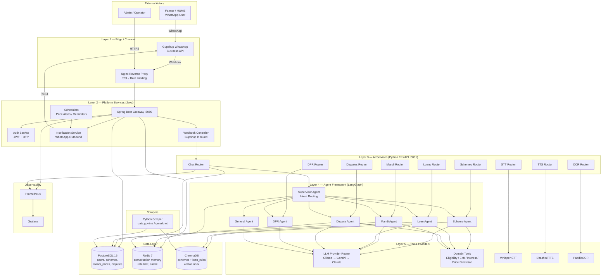
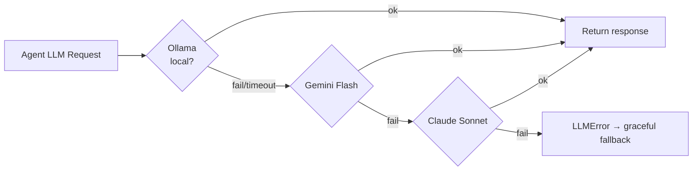
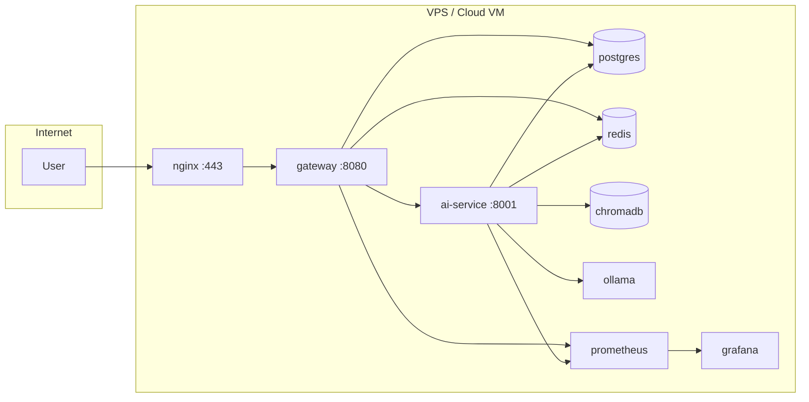

# KisanMitra — System Architecture Diagram

High-level view of the 5-layer architecture, showing how services, data stores, and external integrations fit together.

## Layered Architecture

## Component Responsibilities

| Layer | Component | Responsibility |
|-------|-----------|----------------|
| Edge | Nginx | SSL termination, rate limiting, blocks `/ai/` and `/metrics` externally |
| Edge | Gupshup | WhatsApp Business API transport |
| Platform | Spring Boot Gateway | Auth, webhook intake, outbound notifications, scheduled jobs |
| AI Routers | FastAPI | HTTP surface for each product (chat, mandi, schemes, loans, disputes, DPR, STT, TTS, OCR) |
| Agents | LangGraph | Supervisor routes intent to domain sub-agents |
| Tools | Python libs | EMI calc, MSMED interest, Prophet price prediction, eligibility checks |
| Models | Multi-provider | LLM fallback chain, Whisper STT, Bhashini TTS, PaddleOCR |
| Data | Postgres / Redis / Chroma | Transactional, cache / memory, vector search |
| Ops | Prometheus + Grafana | Metrics, dashboards, alerting |

## LLM Fallback Chain

## Deployment Topology (Production)

