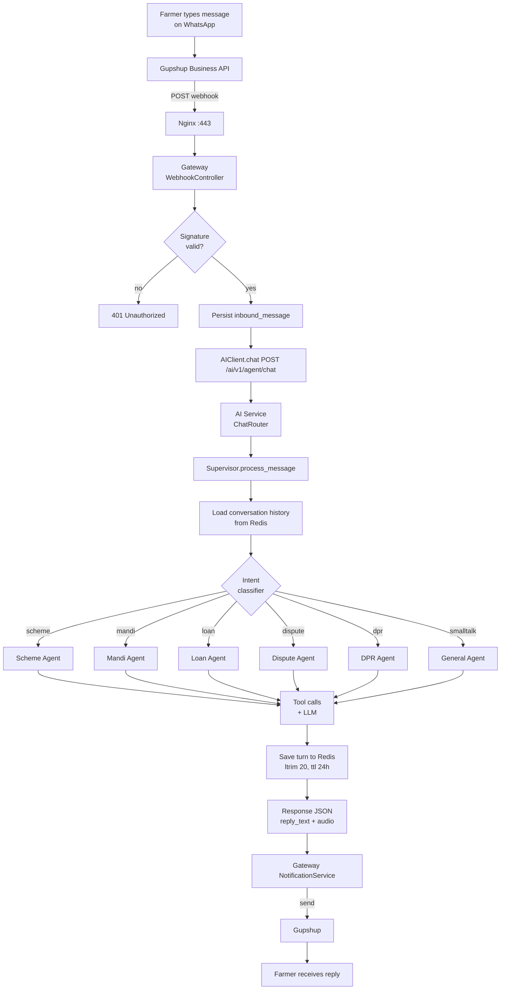
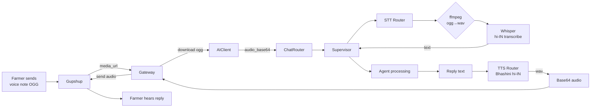
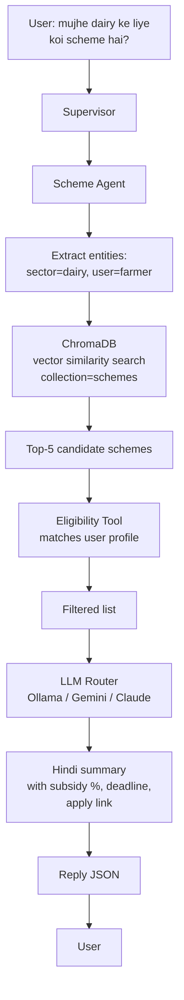
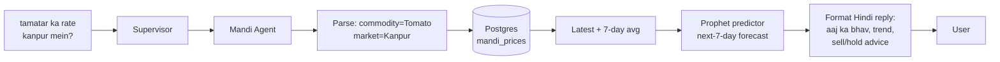
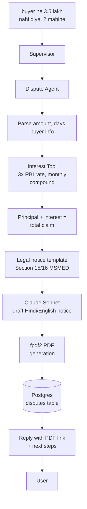
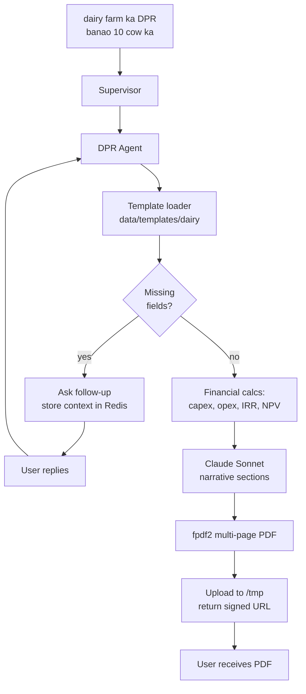
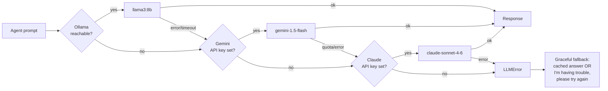
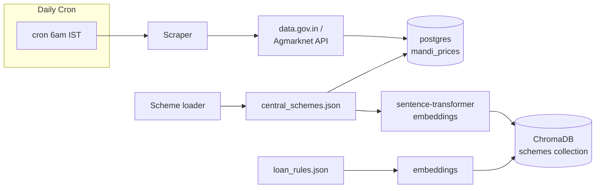

# KisanMitra — Data Flow Diagrams

End-to-end flows for the main use cases. Each diagram traces a request from the farmer's phone to the reply.

---

## 1. Inbound WhatsApp Text Message (High-Level)



---

## 2. Voice Message Flow (WhatsApp Audio → Transcribe → Reply)



---

## 3. Scheme Discovery (RAG Flow)



---

## 4. Mandi Price Query



---

## 5. Loan Eligibility + EMI

```mermaid
flowchart TD
    U[5 lakh dairy loan<br/>chahiye] --> S[Supervisor]
    S --> LA[Loan Agent]
    LA --> C[ChromaDB<br/>loan_rules]
    C --> R[Matching products<br/>NABARD / KCC / PMFME]
    R --> ET[Eligibility tool<br/>land, income, cibil]
    ET --> EMI[EMI tool<br/>P*R*(1+R)^N / ((1+R)^N-1)]
    EMI --> L[LLM formats<br/>comparison table]
    L --> U2[Reply with<br/>best 2-3 options]
```

---

## 6. Dispute Filing (MSMED Act Section 15/16)



---

## 7. DPR Generation (Detailed Project Report)



---

## 8. LLM Provider Fallback



---

## 9. Data Ingestion (Background)



---

## Key Latency Budgets

| Step | Target p95 |
|------|-----------|
| Nginx → Gateway | < 20 ms |
| Gateway → AI Service | < 50 ms |
| Redis memory read | < 10 ms |
| ChromaDB vector search | < 150 ms |
| Postgres query | < 50 ms |
| LLM (Ollama local) | < 2 s |
| LLM (Gemini Flash) | < 1.5 s |
| Whisper STT (15 s audio) | < 3 s |
| Bhashini TTS | < 1 s |
| **End-to-end text reply** | **< 3 s** |
| **End-to-end voice reply** | **< 6 s** |
