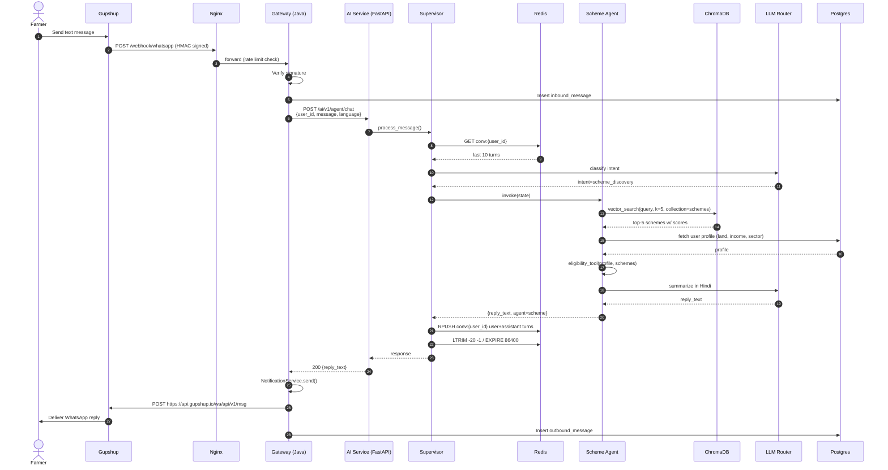
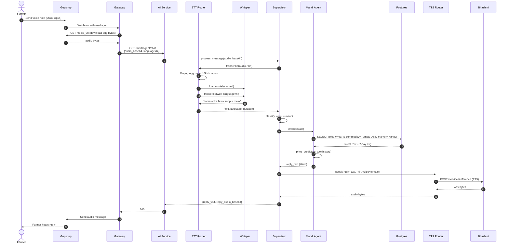
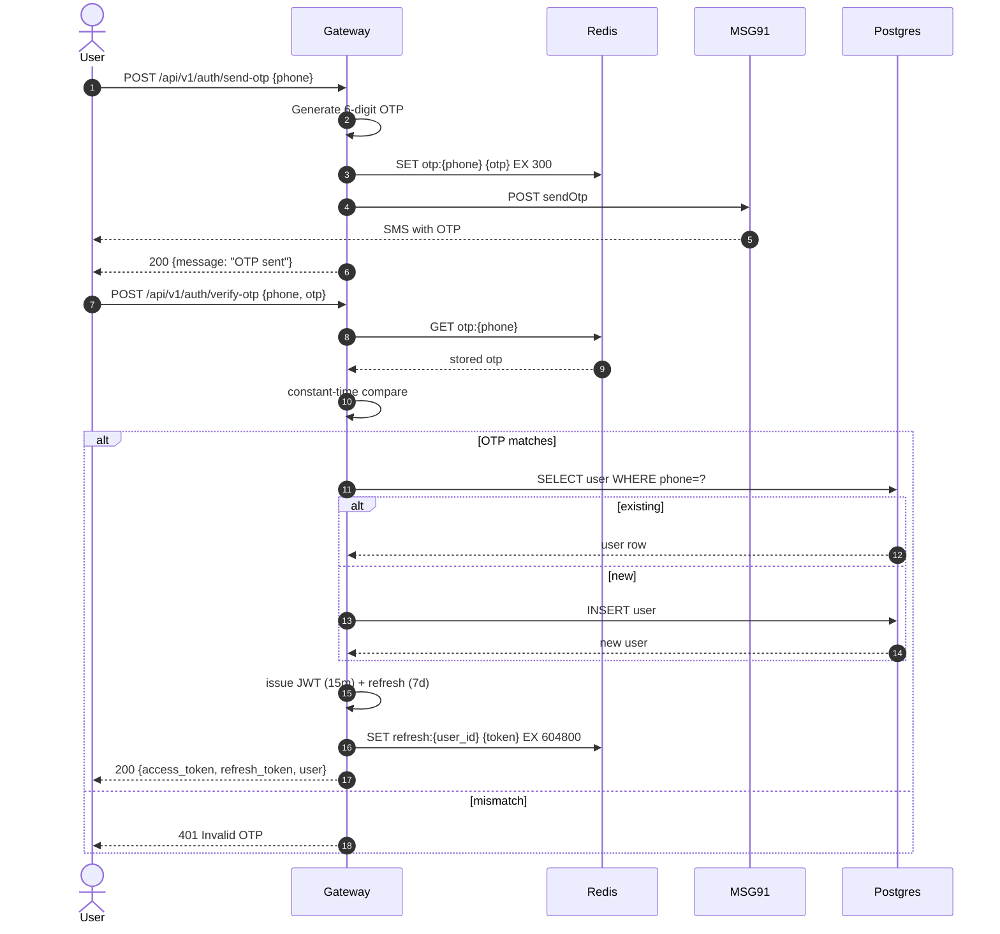
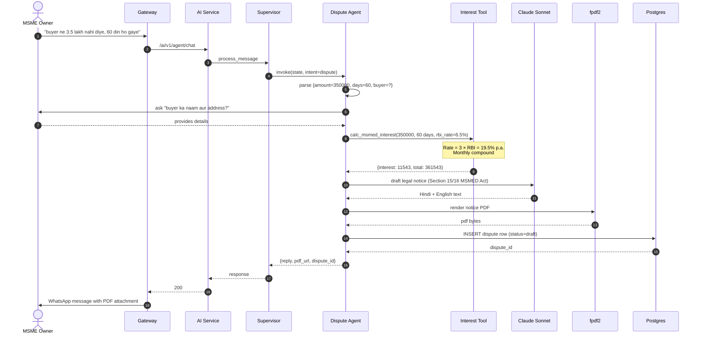
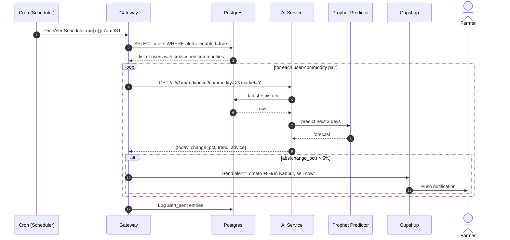
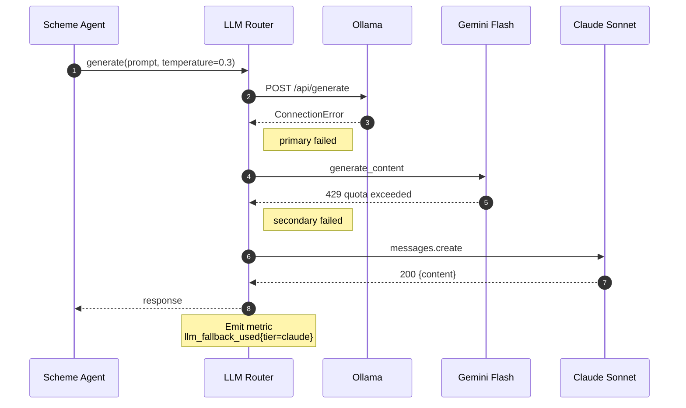
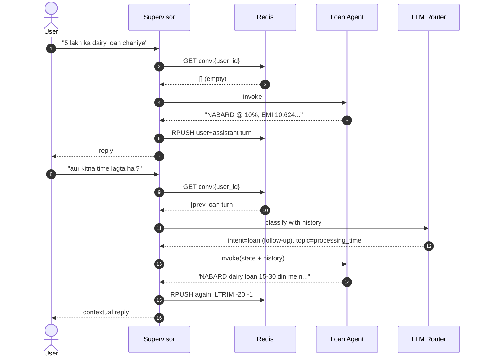
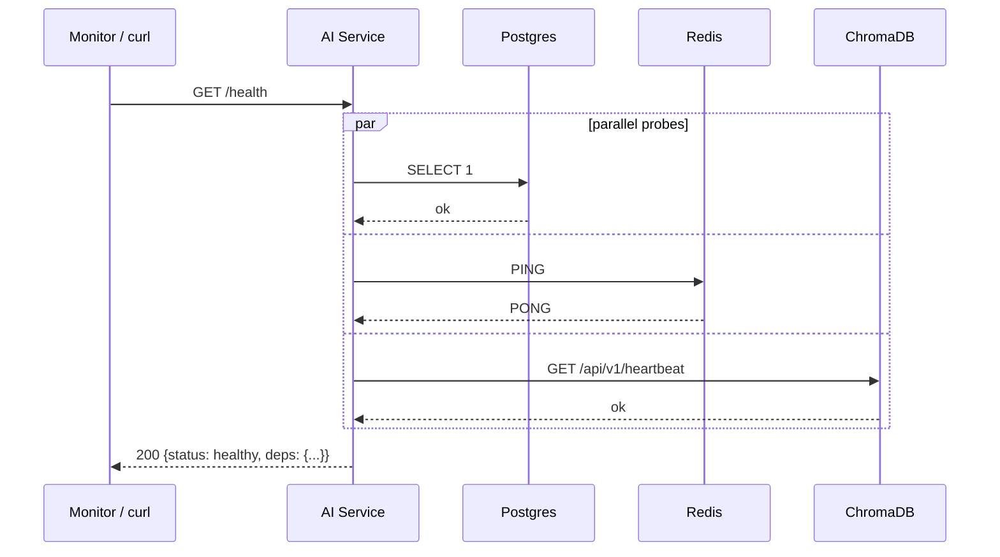

# KisanMitra — Sequence Diagrams

Temporal interactions between components for the most important scenarios. All diagrams use Mermaid and render directly on GitHub.

---

## 1. WhatsApp Text Query — Full Path

Scenario: Farmer sends *"dairy ke liye koi scheme hai?"* via WhatsApp.

---

## 2. Voice Message — STT → Agent → TTS

Scenario: Farmer sends a 12-second Hindi voice note asking for tomato price.

---

## 3. Authentication — Phone OTP Login

---

## 4. Dispute Filing with MSMED Interest

---

## 5. Scheduled Price Alert Job

---

## 6. LLM Fallback on Provider Failure

---

## 7. Conversation Memory (Follow-up Context)

---

## 8. Health Check Sequence

---

## Notes

- All sequences assume the Gateway has already authenticated the request (JWT or HMAC webhook signature).
- Timeouts: AI Service HTTP timeout = 30s, LLM per-provider timeout = 15s, STT = 20s, TTS = 10s.
- Every agent turn emits structured logs with `trace_id` for correlation across services.
- Prometheus metrics: `agent_latency_seconds{agent=...}`, `llm_provider_requests_total{provider=...,status=...}`, `webhook_inbound_total`.
